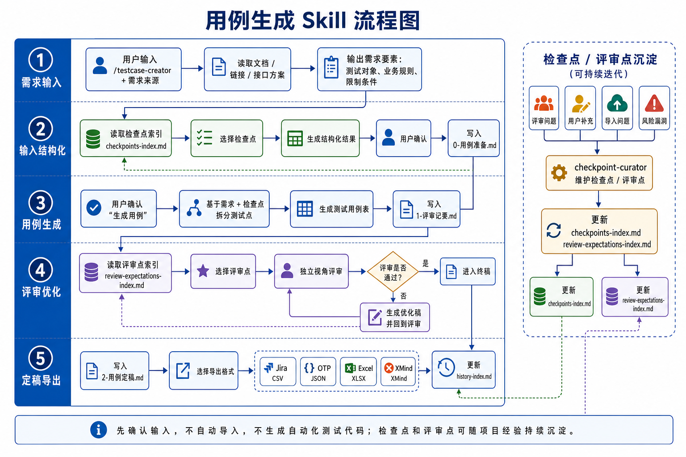

# testcase-creator · 项目级测试用例生成方案

> **先确认输入，不自动导入，不生成自动化测试代码；检查点和评审点可随项目经验持续沉淀。**

---

## 目录结构

```
.
├── .cursor/
│   └── skills/
│       └── testcase-creator/
│           └── skill.md              # Cursor 触发词：/testcase-creator
│
├── .claude/
│   ├── commands/
│   │   ├── testcase-creator.md       # Claude Code 触发词：/testcase-creator
│   │   └── testcase-export.md        # Claude Code 触发词：/testcase-export（独立导出）
│   └── settings.local.json           # Bash 权限白名单（pdftotext / 导出脚本）
│
├── .agents/
│   └── skills/
│       ├── source-command-testcase-creator/
│       │   └── SKILL.md              # Agent/Codex Skill：用例生成
│       └── source-command-testcase-export/
│           └── SKILL.md              # Agent/Codex Skill：独立导出
│
├── .testcase-assets/                  # 项目级可复用资产（建议 Git 管理）
│   ├── project.config.md             # 项目配置（首次使用前必填）
│   ├── checkpoints-index.md          # 检查点索引（UC / PAY / LIST / FILE / RISK / API / CARB / APPR / SUPPLY）
│   ├── review-expectations-index.md  # 评审点索引（UX / DATA / COMP / EXEC / BUG / SEC / PERF）
│   ├── templates/
│   │   ├── testcase-table.md         # 用例表输出模板
│   │   ├── csv-schema.json           # Jira CSV 字段映射规则
│   │   └── jira-csv-template.csv     # Jira CSV 示例文件
│   ├── scripts/
│   │   ├── export_excel.py           # 用例导出为 Excel（需 Python + openpyxl）
│   │   ├── export_xmind.py           # 用例导出为 XMind（需 Python，无额外依赖）
│   │   └── md_to_csv.py              # 用例定稿 MD 转 Jira CSV（需 Python，无额外依赖）
│   └── history/                      # 每次生成的历史记录（自动写入）
│       ├── history-index.md          # 历史运行索引（自动追加）
│       ├── .gitkeep                  # 目录占位文件
│       └── <YYYYMMDD>_<HHMMSS>_<模块名>/   # 每次运行的独立子目录
│           ├── 0-用例准备.md
│           ├── 1-评审记要.md
│           ├── 2-用例定稿.md
│           ├── jira_export.csv       # Jira CSV 导出（可选）
│           ├── export_data.json      # Excel/XMind 中间数据（可选）
│           ├── testcases.xlsx        # Excel 导出（可选）
│           └── testcases.xmind       # XMind 导出（可选）
│
├── TESTCASE_GUIDE.md                 # 纯对话工具（ChatGPT 等）使用指南
├── init-testcase.sh                  # 一键初始化脚本（macOS/Linux）
├── init-testcase.ps1                 # 一键初始化脚本（Windows）
├── CHANGELOG.md                      # 版本变更记录
└── README.md                         # 本文件
```

---

## 环境依赖

| 工具 | 用途 | macOS | Windows |
|------|------|-------|---------|
| Python 3.x | 运行导出脚本 | 系统自带 | [python.org](https://python.org) 或 `winget install Python.Python.3` |
| openpyxl | Excel 导出 | `pip3 install openpyxl` | `pip install openpyxl` |
| pdftotext | 读取 PDF | `brew install poppler` | `winget install poppler`（或 WSL: `apt install poppler-utils`）|
| python-docx | 读取 .docx | 不需要（系统自带 textutil） | `pip install python-docx` |
| XMind 8+ | 打开 .xmind | [xmind.app](https://xmind.app) | [xmind.app](https://xmind.app) |

> **Windows 用户注意**：建议在 WSL（Windows Subsystem for Linux）中运行 Claude Code，这样 bash 命令和 Linux 路径均可直接使用，体验与 macOS 一致。Cursor 原生支持 Windows，无需额外配置。

> XMind 和 Jira CSV 导出无需安装任何额外 Python 包，直接运行即可。

---

## 可用命令

| 命令 | 平台 | 用途 |
|------|------|------|
| `/testcase-creator` | Claude Code / Cursor | 完整用例生成流程（5 阶段，含导出） |
| `/testcase-export` | Claude Code | 独立导出（从已有定稿文件导出，无需重走流程） |
| `source-command-testcase-creator` | Codex | 完整用例生成流程（5 阶段，含导出） |
| `source-command-testcase-export` | Codex | 独立导出（从已有定稿文件导出，无需重走流程） |

---

## 五阶段流程概览



### 1. 需求输入
支持八种来源：
- **A** 直接粘贴文字描述
- **B** 乐享页面链接
- **C** 接口文档链接或本地路径
- **D** 本地文件（`.md` / `.docx` / `.pdf`）
- **E** 图片/截图（`.png` / `.jpg` / `.jpeg` / `.gif` / `.webp`）— UI 设计稿、原型图、流程图
- **F** 飞书文档链接（`feishu.cn` / `larksuite.com`）
- **G** Excel 需求列表（`.xlsx` / `.xls`）
- **H** 需求管理工具链接（Jira / Tapd / 禅道）

提取测试对象、业务规则、限制条件，输出确认清单。确认后创建运行子目录。

### 2. 输入结构化
读取 `checkpoints-index.md`，展示所有分类和检查点，用户选择关联编号，生成结构化摘要写入 `0-用例准备.md`。

### 3. 用例生成
基于需求要素 + 检查点，生成覆盖正向/异常/边界/并发四类的用例表，包含「优先级」列（P0–P3），写入 `1-评审记要.md`。

> 优先级规则：P0=异常场景（阻断性错误）/ P1=正向主流程/边界 / P2=并发 / P3=体验类

### 4. 评审优化
读取 `review-expectations-index.md`，用户选择评审维度，AI 独立视角逐条判断覆盖情况，输出评审报告和补充建议，支持多轮迭代。

### 5. 定稿导出
写入 `2-用例定稿.md`，然后统一选择导出平台（可多选）：

| 选项 | 格式 | 说明 |
|------|------|------|
| **J** | Jira CSV (`.csv`) | 可直接导入 Jira，UTF-8 with BOM 编码 |
| **E** | Excel (`.xlsx`) | 带场景颜色、冻结表头、优先级、统计 Sheet |
| **X** | XMind (`.xmind`) | 四级结构（检查点 → 场景类型 → 用例 → 步骤） |

导出完成后自动更新 `history-index.md` 索引。

---

## 快速上手

### 方式一：clone 本仓库后初始化到你的项目

```bash
# macOS / Linux
bash init-testcase.sh /path/to/your-project
```

```powershell
# Windows PowerShell
.\init-testcase.ps1 -TargetDir C:\path\to\your-project

# 若遇到执行策略限制，先运行：
# Set-ExecutionPolicy -Scope CurrentUser RemoteSigned
```

> 脚本会自动完成：
> - 复制所有资产文件（Agent/Codex skills / Cursor skill.md / Claude commands / checkpoints / scripts / templates 等）
> - 根据当前用户名动态生成 .claude/settings.local.json（Windows 会自动检测 WSL）
> - 在目标项目的 .gitignore 追加 history/ 规则
> - 初始化 history-index.md

# 5. 必填：编辑项目配置
vim /path/to/your-project/.testcase-assets/project.config.md

> **注意**：`.claude/settings.local.json` 包含本机路径，不会进入 git。
> 每个开发者在自己机器上运行 `init-testcase.sh` 时会自动生成对应版本。

---

### 方式二：在本仓库直接使用（不复制到其他项目）

```bash
# 第一次使用前，手动生成本机的 settings.local.json
bash init-testcase.sh .   # 用 . 表示当前目录（本仓库本身）

# 或直接手动创建（把 YOUR_USERNAME 替换成你的 macOS 用户名）
# .claude/settings.local.json 已在 .gitignore 中，放心写
```

### Cursor 用户
1. 完成上述初始化
2. 在 Cursor 中输入 `/testcase-creator` 触发流程
3. 按提示逐步确认

### Claude Code 用户
1. 完成上述初始化，确认 `.claude/settings.local.json` 中的权限白名单路径与本机一致
2. 在 Claude Code 中输入 `/testcase-creator` 触发流程
3. 选择需求来源 D（PDF）时，工具会自动使用 `pdftotext` 读取内容

### Codex 用户
1. 完成上述初始化，确认 `.agents/skills/` 下存在 `source-command-testcase-creator` 和 `source-command-testcase-export`
2. `.agents/skills/` 是面向 Agent 类工具的技能目录；在本项目中，Codex 可通过该目录识别项目技能
3. 在 Codex 中直接说明“运行 testcase-creator”或“生成测试用例”，Codex 会匹配 `source-command-testcase-creator`
4. 已有定稿文件时，说明“运行 testcase-export”或“导出测试用例”，Codex 会匹配 `source-command-testcase-export`

### 纯对话工具（ChatGPT / Copilot 等）
1. 打开 `TESTCASE_GUIDE.md`，将全文复制
2. 同时复制以下文件内容，一并粘贴到对话开头：
   - `project.config.md`
   - `checkpoints-index.md`
   - `review-expectations-index.md`
3. 按流程交互，手动保存输出内容
4. 若需 Excel/XMind 导出，将 AI 输出的 `export_data.json` 保存到本地，手动运行导出脚本

---

## 导出格式说明

### Jira CSV（md_to_csv.py）

| 特性 | 说明 |
|------|------|
| 编码 | UTF-8 with BOM（确保 Jira 导入时中文不乱码） |
| 列 | 序号 / 标题 / 描述 / 优先级 / 步骤ID / 步骤 / 测试数据 / 期望结果 / 需求 / 测试用例集 |
| 多步骤用例 | 首行填写用例基础信息，后续行仅填写步骤详情 |
| 优先级映射 | P0→High, P1→Medium, P2→Low |

### Excel（export_excel.py）

| 特性 | 说明 |
|------|------|
| 列 | 用例ID / 测试点 / 前置条件 / 操作步骤 / 预期结果 / 关联检查点 / 场景类型 / 优先级 / 执行状态 / 编写人 / 执行人 / 备注 |
| 场景分组 | 每组首行加彩色粗边框分隔（正向/异常/边界/并发各自一色） |
| 场景类型列 | 深色徽章样式（绿/红/橙/蓝）|
| 优先级列 | P0–P3 自动着色 |
| 筛选/冻结 | 列名行筛选器 + 前两行冻结 |
| 统计 Sheet | 各场景类型用例数 + 柱状图 |
| 打印 | A4 横向，自动缩放，每页重复表头 |

### XMind（export_xmind.py）

| 特性 | 说明 |
|------|------|
| 结构 | 四级：根节点 → 检查点 → 场景类型 → 用例 → 步骤细节 |
| 步骤 | 每步独立子节点，操作步骤作为父节点折叠 |
| 优先级 | 显示为用例节点的标签（P0/P1/P2） |
| Sheet 2 | 统计总览：场景类型 → 各检查点覆盖条数 |
| 兼容性 | XMind 8 或更高版本 |

```bash
# 手动运行导出（Claude Code 会自动调用）
python3 .testcase-assets/scripts/md_to_csv.py <input.md> <output.csv>
python3 .testcase-assets/scripts/export_excel.py <input.json> <output.xlsx>
python3 .testcase-assets/scripts/export_xmind.py <input.json> <output.xmind>
```

---

## 历史记录管理

每次运行 `/testcase-creator` 会创建独立子目录：

```
.testcase-assets/history/
├── history-index.md                          # 索引文件（自动追加）
├── 20260601_174203_碳盘查清单/               # 第 1 次运行
│   ├── 0-用例准备.md
│   ├── 1-评审记要.md
│   ├── 2-用例定稿.md
│   └── jira_export.csv
└── 20260615_090000_用户中心/                 # 第 2 次运行
    └── ...
```

- **history-index.md**：自动记录每次运行的时间、模块、用例数、导出文件
- **独立导出**：使用 `/testcase-export` 可随时从已有定稿文件导出，无需重走流程

### 命名规范

**子目录命名**：`<YYYYMMDD>_<HHMMSS>_<模块名>`

| 部分 | 格式 | 示例 |
|------|------|------|
| 日期 | YYYYMMDD | 20260601 |
| 时间 | HHMMSS | 174203 |
| 模块名 | 中文关键词（自动清理特殊字符） | 碳盘查清单 |

示例：`20260601_174203_碳盘查清单`

**子目录内文件命名**：

| 文件 | 说明 |
|------|------|
| `0-用例准备.md` | 阶段 2 输出：需求要素 + 检查点关联 |
| `1-评审记要.md` | 阶段 3/4 输出：用例表 + 评审记录 |
| `2-用例定稿.md` | 阶段 5 输出：最终定稿用例表 |
| `jira_export.csv` | Jira CSV 导出（若选 J） |
| `export_data.json` | Excel/XMind 中间数据（若选 E/X） |
| `testcases.xlsx` | Excel 导出（若选 E） |
| `testcases.xmind` | XMind 导出（若选 X） |

---

## 资产管理规范

| 操作 | 规范 |
|------|------|
| 新增检查点 | 追加到对应分类末尾，编号递增，不修改已有编号 |
| 废弃检查点 | 描述后追加 `[已废弃]`，不删除行 |
| 新增评审点 | 同上 |
| 历史文件 | 每次运行归入独立子目录，`history-index.md` 自动维护索引 |
| Git 提交 | 更新索引文件后单独提交，格式：`chore: 沉淀检查点 XX-XX` |
| history/ 目录 | 已加入 `.gitignore`，不纳入版本控制（可按需调整） |

---

## Jira CSV 导入说明

> **注意**：CSV 文件编码为 UTF-8 with BOM，确保 Jira 导入时中文不乱码。

### 导入步骤

1. 运行流程至阶段 5，选择「J」生成 CSV 文件（或使用 `/testcase-export` 独立导出）
2. 登录 Jira 系统，进入目标项目
3. 导入路径：
   - **Jira Cloud**：项目设置 → Issue Types → Import Issues from CSV
   - **Jira Server/Data Center**：项目 → 导入与导出 → 从 CSV 导入
4. 上传 `jira_export.csv`，按向导完成字段映射
5. 确认导入，检查用例是否正确创建

### CSV 字段说明

| CSV 列 | Jira 字段 | 说明 |
|--------|-----------|------|
| 序号 | Issue Key / 自定义字段 | 用例编号（TC-001） |
| 标题 | Summary | 测试点标题 |
| 描述 | Description | 前置条件 |
| 优先级 | Priority | High / Medium / Low |
| 步骤ID | Test Steps (Step #) | 步骤序号 |
| 步骤 | Test Steps (Action) | 操作步骤 |
| 测试数据 | Test Steps (Data) | 测试数据（可为空） |
| 期望结果 | Test Steps (Expected Result) | 预期结果 |
| 需求 | Labels / 自定义字段 | 关联检查点编号 |
| 测试用例集 | Component / 自定义字段 | 所属测试套件 |

### 常见问题

| 问题 | 解决方案 |
|------|----------|
| 中文乱码 | 确保 CSV 为 UTF-8 with BOM 编码，Jira 导入时选择 UTF-8 |
| 多步骤用例丢失 | Jira 需要支持 Test Steps 的插件（如 Xray、Zephyr），否则步骤会合并在描述中 |
| 优先级不匹配 | Jira 默认优先级为 Highest/High/Medium/Low/Minor，CSV 中 High/Medium/Low 可直接映射 |
| 字段映射失败 | 导入时手动将 CSV 列映射到对应的 Jira 字段 |

### Jira 插件兼容性

| 插件 | 支持程度 | 说明 |
|------|----------|------|
| Xray | 完全支持 | 原生支持 Test Steps 导入，字段可直接映射 |
| Zephyr Scale | 完全支持 | 支持 CSV 导入测试用例和步骤 |
| Jira 原生 | 部分支持 | 无 Test Steps 概念，步骤内容需合并到描述字段 |

---

*由 testcase-creator skill 维护 · 最后更新：2026-06-03*
